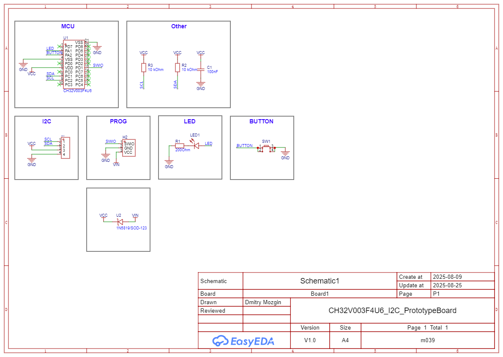
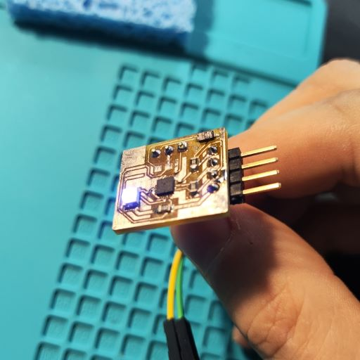
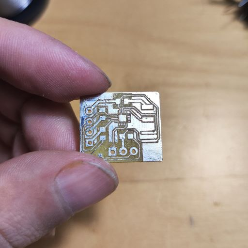

# CH32V003F4U6 I2C Prototype Board

The purpose of this board is to evaluate my ability to fabricate and solder a QFN chip onto a PCB manufactured using CNC technology. I have successfully completed this task, proving that it is indeed feasible.

# Code

* [I2C_Slave](https://github.com/m039/ch32v-playground/CH32V003F4U6_I2C_PrototypeBoard/Code/I2C_Slave) - a program that blinks when receive message by I2C.
* [I2C_Master](https://github.com/m039/ch32v-playground/CH32V003F4U6_I2C_PrototypeBoard/Code/I2C_Master) -  a program that sends a blink request to `I2C_Slave`

# Schematic

# Photos

